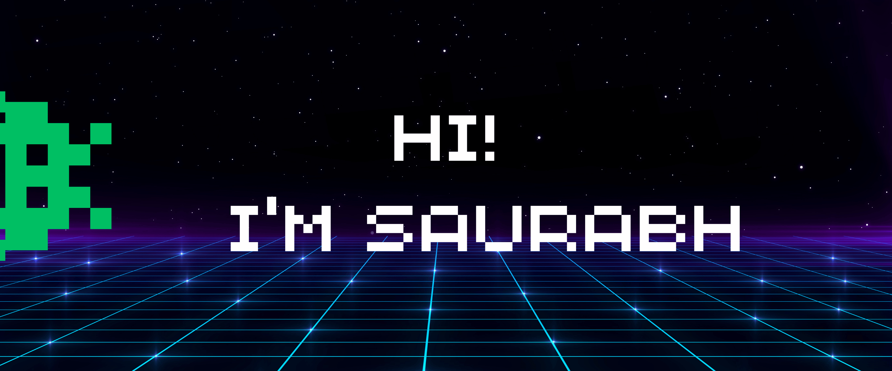

👋 Hey there! I'm Saurabh, a Sofware Developer 💻 with ~2 years of experience 🚀. I'm currently working on building responsive applications and websites 🌐 using Angular, JavaScript, TypeScript, HTML, and CSS 🎨 for front-end development.On the back-end, in Java, Groovy, and SpringBoot 🌟.

I'm passionate about continuously learning 📚 and keeping up with the latest technology trends 💡. Let's connect and make something awesome! 🤝

 

  <!--
**srbhr/srbhr** is a ✨ _special_ ✨ repository because its `README.md` (this file) appears on your GitHub profile.

Here are some ideas to get you started:

- 🔭 I’m currently working on ...
- 🌱 I’m currently learning ...
- 👯 I’m looking to collaborate on ...
- 🤔 I’m looking for help with ...
- 💬 Ask me about ...
- 📫 How to reach me: ...
- 😄 Pronouns: ...
- ⚡ Fun fact: ...
-->
